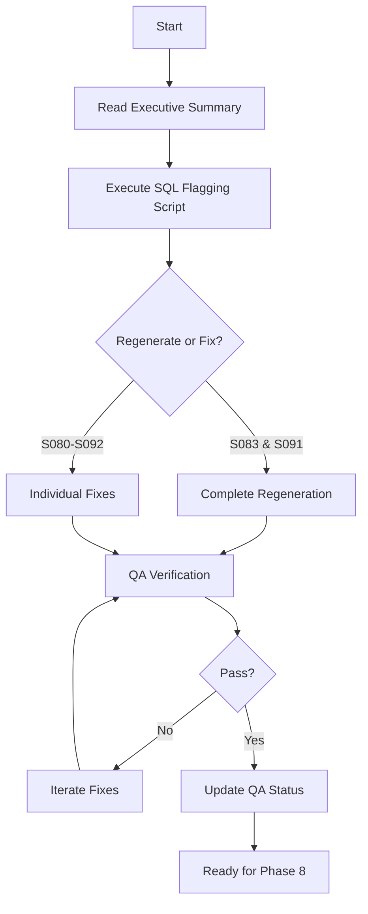

# QA Report Index: ita_for_eng Seeds 69-97 (Pass 3)

**Generated:** 2026-02-09 23:12 UTC
**Scope:** Seeds 69-97 (29 seeds, 539 USE phrases)
**Issues found:** 38 speakability errors (7.1% failure rate)
**Focus:** Grammar errors only (punctuation/capitalization ignored)

---

## Quick Start

**For immediate action:**
1. Read: `QA_ITA_SEEDS_69_97_EXECUTIVE_SUMMARY.txt` (2 min)
2. Execute: `/tmp/flag_ita_69_97_issues.sql` (5 min)
3. Follow: `QA_ITA_SEEDS_69_97_ACTION_PLAN.md` (6-8 hours)

**Critical finding:** Seeds 83 & 91 need complete regeneration (25/38 issues)

---

## Document Overview

### 📊 Executive Summary
**File:** `QA_ITA_SEEDS_69_97_EXECUTIVE_SUMMARY.txt`
**Purpose:** High-level overview for decision makers
**Contents:**
- Key findings
- Issue breakdown by category
- Recommended actions
- Comparison with previous QA passes

**Read this first** if you need the big picture.

---

### 📋 Detailed Report
**File:** `QA_ITA_SEEDS_69_97_PASS3.md`
**Purpose:** Complete technical analysis
**Contents:**
- Full issue catalog with examples
- Pattern analysis by error type
- Seeds requiring attention
- Systematic error patterns
- Prevention recommendations

**Read this** for complete understanding of all issues.

---

### 🎯 Action Plan
**File:** `QA_ITA_SEEDS_69_97_ACTION_PLAN.md`
**Purpose:** Step-by-step fix procedure
**Contents:**
- 6-phase execution plan
- SQL commands for each fix
- Timeline estimates
- Success criteria
- Rollback procedures

**Use this** as your execution checklist.

---

### 🔧 Fix Guide
**File:** `QA_ITA_SEEDS_69_97_FIX_GUIDE.md`
**Purpose:** Quick reference for pattern-based fixes
**Contents:**
- Find/replace patterns
- Fix rules for each error type
- Prioritized fix order
- Verification commands

**Use this** for quick pattern-based corrections.

---

### 📈 Visual Summary
**File:** `QA_ITA_SEEDS_69_97_VISUAL_SUMMARY.txt`
**Purpose:** At-a-glance issue distribution
**Contents:**
- ASCII bar charts by seed
- Issue type frequency visualization
- Severity heatmap
- Quality impact metrics
- Effort estimates

**Use this** for status reporting and prioritization.

---

### 📄 CSV Export
**File:** `QA_ITA_SEEDS_69_97_ISSUES.csv`
**Purpose:** Spreadsheet-compatible issue list
**Contents:**
- Seed number, Phrase ID, English, Italian, Issues
- All 38 flagged phrases in tabular format

**Use this** for:
- Importing into spreadsheet software
- Batch processing scripts
- Progress tracking
- Sharing with non-technical reviewers

---

### 💾 Machine-Readable Data
**File:** `/tmp/qa_issues_final.json`
**Purpose:** Structured data for automation
**Contents:**
- Complete issue data in JSON format
- Includes IDs, texts, error classifications

**Use this** for:
- Automated fix scripts
- Integration with other tools
- Programmatic analysis

---

### 🗄️ SQL Script
**File:** `/tmp/flag_ita_69_97_issues.sql`
**Purpose:** Database update script
**Contents:**
- UPDATE statement to flag 38 phrases
- Verification queries
- Transaction safety (BEGIN/COMMIT)

**Execute this** to flag issues in Supabase.

---

### 📝 Error Patterns
**File:** `/tmp/error_patterns.txt`
**Purpose:** Issues grouped by pattern
**Contents:**
- Errors organized by type
- Examples for each pattern
- Frequency counts

**Use this** for understanding systematic errors.

---

## Issue Categories

| Category | Count | Priority | Examples |
|----------|-------|----------|----------|
| **Missing Prepositions** | 14 | HIGH | pronto parlare → pronto a parlare |
| **Gender Agreement** | 11 | HIGH | del risposta → della risposta |
| **Missing Conjunctions** | 9 | HIGH | penso è → penso che è |
| **Elision** | 3 | MEDIUM | del amico → dell'amico |
| **Article Usage** | 3 | MEDIUM | del tuo amico (needs review) |
| **Verb Forms** | 2 | MEDIUM | aver fatto → ho fatto |
| **Verb Conjugation** | 1 | LOW | vuoi → vuole |
| **Reflexive Pronouns** | 1 | LOW | prendersi → prendermi |

---

## Seeds Status

| Seed | Issues | Status | Action Required |
|------|--------|--------|-----------------|
| **S083** | 14 | 🔴 Critical | Complete regeneration |
| **S091** | 11 | 🔴 Critical | Complete regeneration |
| S089 | 4 | 🟡 Medium | Individual fixes |
| S084 | 4 | 🟡 Medium | Individual fixes |
| S080 | 3 | 🟡 Medium | Individual fixes |
| S092 | 2 | 🟢 Low | Quick fixes |

---

## Workflow



---

## Deliverables Checklist

- [x] Executive summary
- [x] Detailed technical report
- [x] Action plan with timeline
- [x] Fix guide (quick reference)
- [x] Visual summary (charts)
- [x] CSV export (38 issues)
- [x] JSON data (machine-readable)
- [x] SQL flagging script
- [x] Error patterns analysis
- [x] This index document

---

## Next Steps

### Immediate (Today)
1. Flag 38 phrases in database (`/tmp/flag_ita_69_97_issues.sql`)
2. Review flagged phrases in Production API dashboard
3. Assign S083 & S091 regeneration to linguist

### Short-term (This Week)
1. Complete S083 regeneration (3 hours)
2. Complete S091 regeneration (3 hours)
3. Fix S080, S084, S089, S092 individually (2 hours)
4. Run QA verification pass

### Medium-term (This Sprint)
1. Add prepositional government validation to Course Builder
2. Add gender agreement checks
3. Add subordinate clause structure validation
4. Proceed to Phase 8 (audio generation) after 100% QA pass

---

## Related Documents

- **Previous QA:** `QA_ITA_SEEDS_69_97_FLAGGED.md` (Pass 2, 95 issues)
- **Course Status:** `MEMORY.md` (ita_for_eng: 300/300 seeds complete)
- **Methodology:** `ralph-methodology.md` (Course building guidelines)
- **Architecture:** `CLAUDE.md` (System overview)

---

## Contact & Support

**QA Agent:** Claude Sonnet 4.5 (Anthropic)
**Generated:** 2026-02-09 23:12 UTC
**Version:** Pass 3 (Speakability-only QA)

**For questions:**
- Technical issues: Review `QA_ITA_SEEDS_69_97_PASS3.md`
- Execution: Follow `QA_ITA_SEEDS_69_97_ACTION_PLAN.md`
- Quick fixes: Reference `QA_ITA_SEEDS_69_97_FIX_GUIDE.md`

---

## File Locations

All documents located in:
```
/Users/tomcassidy/SSi/ssi-dashboard-v7-clean/
├── QA_ITA_SEEDS_69_97_INDEX.md (this file)
├── QA_ITA_SEEDS_69_97_EXECUTIVE_SUMMARY.txt
├── QA_ITA_SEEDS_69_97_PASS3.md
├── QA_ITA_SEEDS_69_97_ACTION_PLAN.md
├── QA_ITA_SEEDS_69_97_FIX_GUIDE.md
├── QA_ITA_SEEDS_69_97_VISUAL_SUMMARY.txt
└── QA_ITA_SEEDS_69_97_ISSUES.csv
```

Temporary files (SQL, JSON) in:
```
/tmp/
├── flag_ita_69_97_issues.sql
├── qa_issues_final.json
└── error_patterns.txt
```

---

**End of Index**
