# Course Production Suite - System Diagrams

**Mermaid Diagrams for Architecture Visualization**

Version: 1.0.0
Date: 2025-12-04

---

## System Architecture Overview

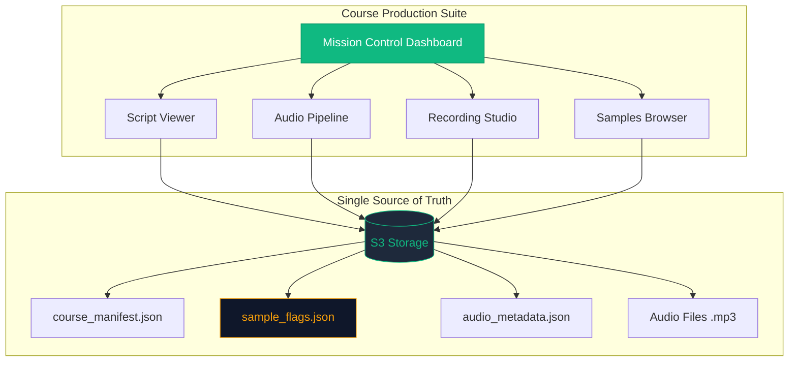

---

## Data Flow Architecture

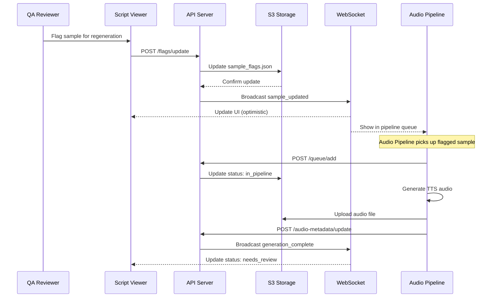

---

## Sample Status Lifecycle

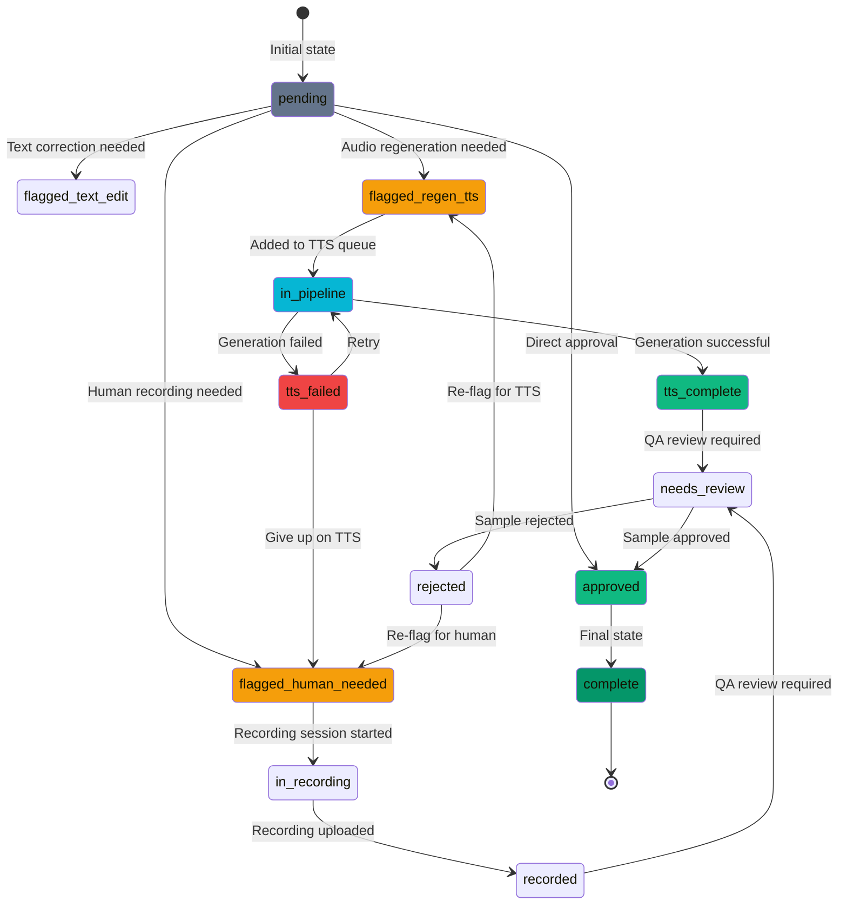

---

## Component Interaction Flow

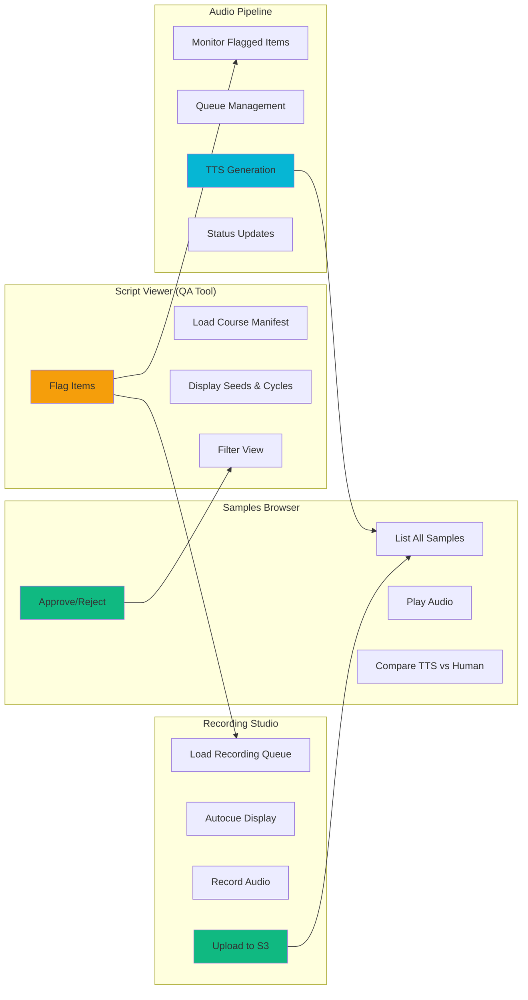

---

## Navigation Structure

```mermaid
graph TD
    Root[/production]
    Course[/production/:courseCode]
    Script[/production/:courseCode/script]
    Pipeline[/production/:courseCode/audio-pipeline]
    Recording[/production/:courseCode/recording]
    Samples[/production/:courseCode/samples]

    Root --> Course
    Course --> Script
    Course --> Pipeline
    Course --> Recording
    Course --> Samples

    Script --> ScriptDeep[?seed=S0042]
    Recording --> RecordQueue[?queue=xyz]
    Samples --> SamplesFilter[?status=flagged]

    style Root fill:#10b981,stroke:#059669,color:#fff
    style Course fill:#10b981,stroke:#059669,color:#fff
    style ScriptDeep fill:#0f172a,stroke:#10b981
    style RecordQueue fill:#0f172a,stroke:#10b981
    style SamplesFilter fill:#0f172a,stroke:#10b981
```

---

## API Endpoint Structure

```mermaid
graph TB
    subgraph "Production API"
        Root[/api/production/:courseCode]

        subgraph "Core Endpoints"
            Manifest[GET /manifest]
            Flags[GET /flags]
            FlagsUpdate[POST /flags/update]
            AudioMeta[GET /audio-metadata]
        end

        subgraph "Script Endpoints"
            Seeds[GET /script/seeds]
            Seed[GET /script/seeds/:seedId]
            Samples[GET /script/samples]
        end

        subgraph "Pipeline Endpoints"
            Status[GET /audio-pipeline/status]
            QueueAdd[POST /audio-pipeline/queue/add]
            Retry[POST /audio-pipeline/queue/retry]
        end

        subgraph "Recording Endpoints"
            Queues[GET /recording/queues]
            CreateQueue[POST /recording/queues/create]
            Upload[POST /recording/upload]
        end

        subgraph "Samples Endpoints"
            List[GET /samples/list]
            Detail[GET /samples/:uuid]
            Approve[POST /samples/:uuid/approve]
            Reject[POST /samples/:uuid/reject]
        end

        Root --> Manifest
        Root --> Flags
        Root --> FlagsUpdate
        Root --> AudioMeta

        Root --> Seeds
        Root --> Seed
        Root --> Samples

        Root --> Status
        Root --> QueueAdd
        Root --> Retry

        Root --> Queues
        Root --> CreateQueue
        Root --> Upload

        Root --> List
        Root --> Detail
        Root --> Approve
        Root --> Reject
    end

    WS[WebSocket /api/production/websocket]

    style Root fill:#10b981,stroke:#059669,color:#fff
    style WS fill:#f59e0b,stroke:#d97706,color:#fff
```

---

## Flag Update Process Flow

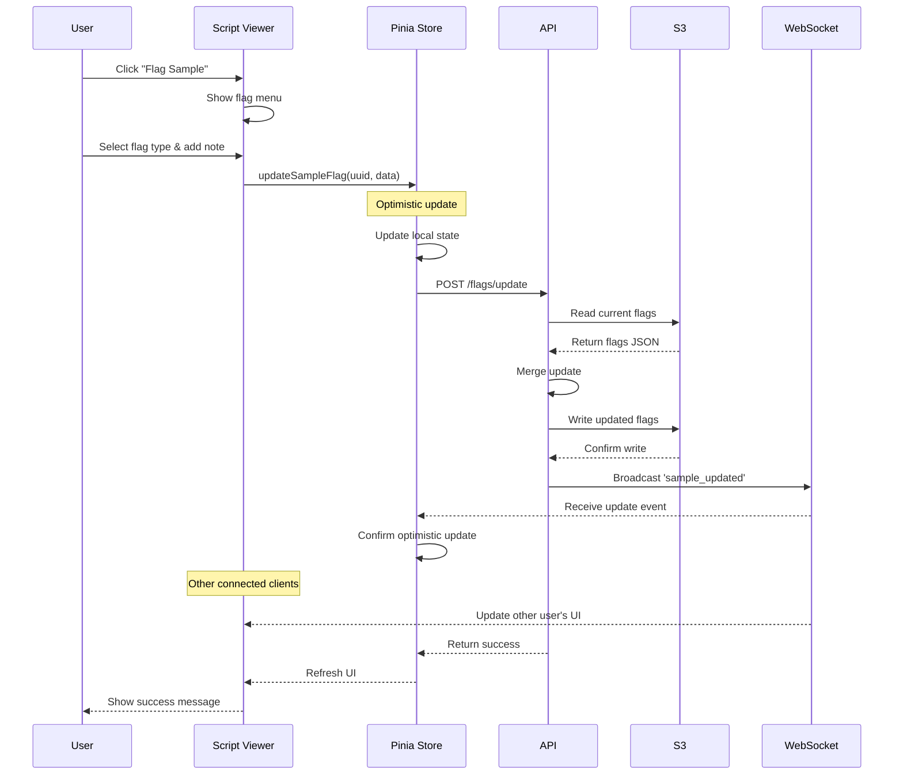

---

## Recording Studio Workflow

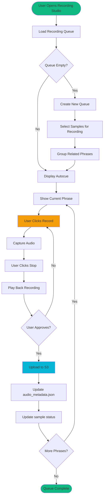

---

## Audio Pipeline Processing Flow

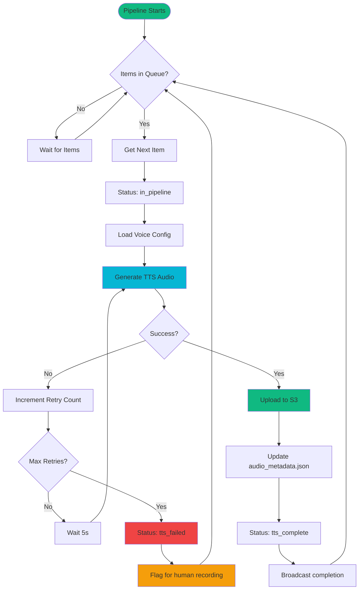

---

## Mission Control Dashboard Data Flow

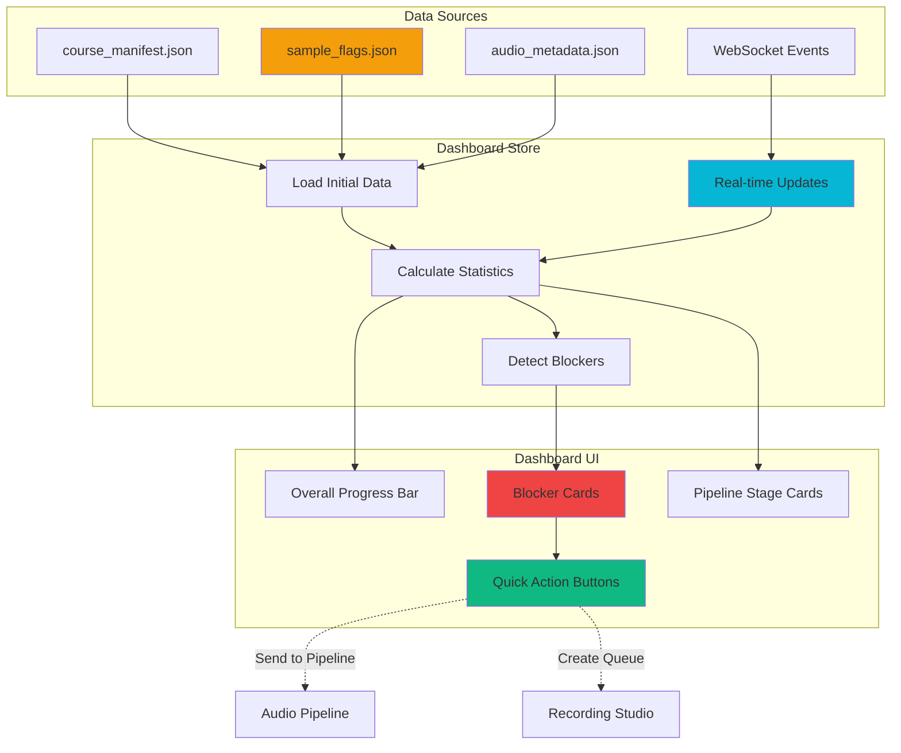

---

## Multi-User Collaboration Flow

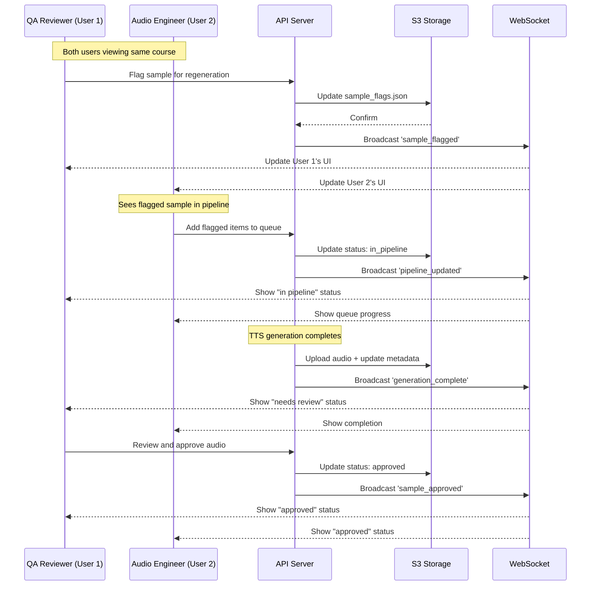

---

## Component Hierarchy

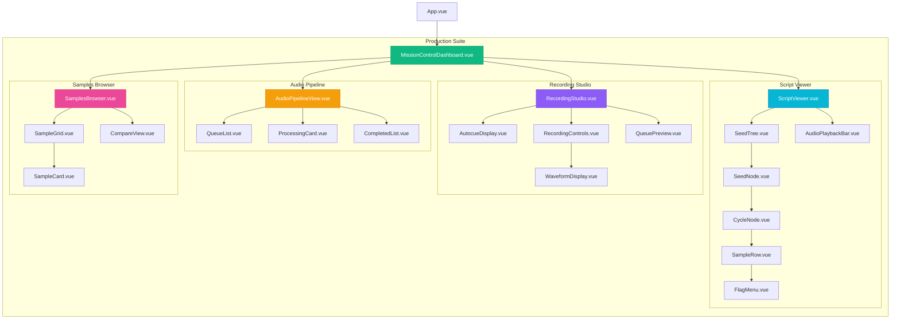

---

## State Management (Pinia Store)

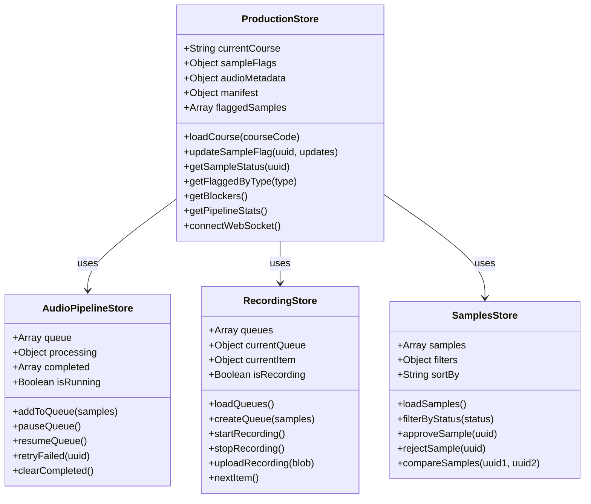

---

## S3 Storage Structure

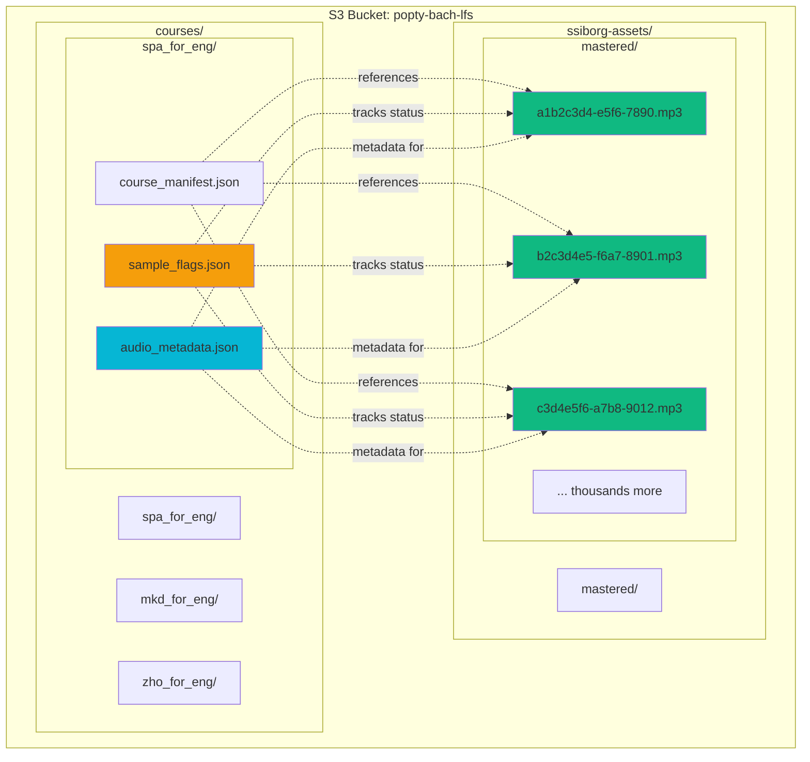

---

*Diagrams created with Mermaid*
*Version: 1.0.0*
*Date: 2025-12-04*

**Note:** These diagrams can be rendered in any Markdown viewer that supports Mermaid syntax (GitHub, GitLab, VS Code with Mermaid extension, etc.)
